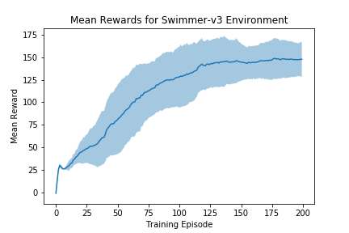
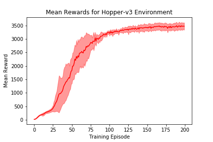
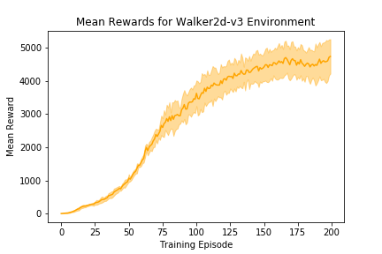

# TRPO + GAE

An implementation of Trust Region Policy Optimization (Schulman 2015) with Generalized Advantage Estimation (Schulman 2016). This implementation can handle environments with both discrete and continuous action spaces.

## Results

Below are this implementation's results on three different simulated locomotion tasks.

